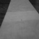

# STAT 441 Project

## Data Description

### Data Source
The dataset was collected as part of a hobby project completed during the summer of 2020, with the goal of building a simple self-driving vehicle from the ground up. Images were captured at 64x64 resolution from a Raspberry Pi Camera (PiCamera) mounted on a vehicle prototype navigating a track.

Data collection was performed autonomously using a non-ML algorithm based on t-tests of pixel intensity differences between bottom-left and bottom-right image regions. This statistical method reliably detected track edges and generated steering commands, allowing the vehicle to autopilot the track while simultaneously collecting image-label pairs. The algorithm determined steering direction by comparing pixel intensities at the bottom corners of each frame to identify when the vehicle approached track boundaries, and these automated steering decisions became the labels for the collected images.

### Dataset
The dataset consists of nearly 10,000 paired samples, where each sample contains:
- **Image**: 64x64 grayscale image captured from the onboard camera
- **Label**: Steering direction with three classes:
  - Left turn: -1
  - Forward: 0
  - Right turn: 1

**Preprocessing:**

- Images are converted from RGB to grayscale
- Pixel values are normalized to [0, 1] range for model training

#### Dataset Summary

| Left Turn | Forward | Right Turn |
|:---------:|:-------:|:----------:|
|  |  |  |
| **Label:** -1 | **Label:** 0 | **Label:** 1 |
| **Samples:** 1,620 | **Samples:** 7,343 | **Samples:** 937 |
| **Proportion:** 16.4% | **Proportion:** 74.2% | **Proportion:** 9.5% |

**Total dataset size:** 9,900 samples

The images show the vehicle's perspective of the track, with the lighter gray surface representing the drivable area and black regions indicating track edges.

## Classification Methods

### Previous Work
The original 2020 project explored several CNN-based solutions for steering prediction, including an AlexNet architecture trained on this dataset. However, these initial attempts lacked rigorous statistical analysis and model evaluation methodologies.

### Planned Approach
This project aims to revisit the self-driving vehicle problem with proper statistical rigor, applying techniques and principles learned in STAT 441. The team plans to:

1. **Data Analysis**: Conduct thorough exploratory data analysis to understand feature distributions, class imbalance effects, and potential data quality issues

2. **Model Selection**: Evaluate multiple classification approaches, including:
   - Various CNN architectures (beyond AlexNet)
   - Modern deep learning techniques and architectures where appropriate
   - Comparative analysis of different model complexities

3. **Temporal Information**: Investigate methods to capture sequential dependencies in the data, as consecutive frames contain temporal relationships that could improve prediction accuracy

4. **Rigorous Evaluation**: Implement proper train/validation/test splits, cross-validation, and statistical testing to ensure robust model comparison and performance estimation 
